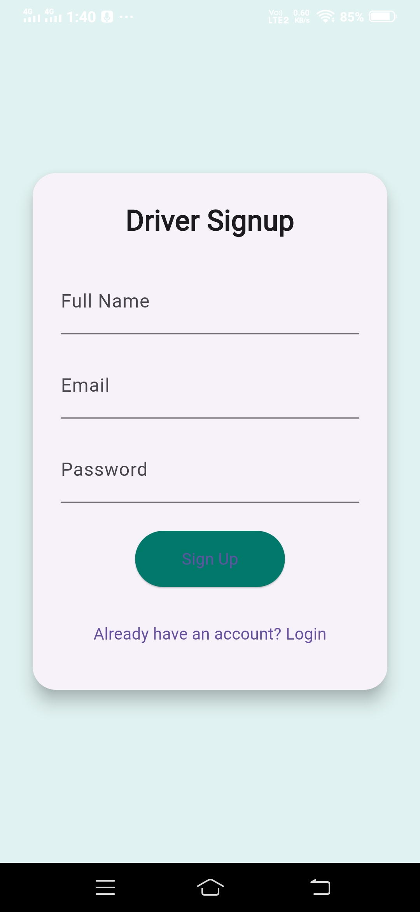

# 🚌 Track Your Bus App

A Flutter-based real-time bus tracking system designed for HITAM College. This app helps **students**, **faculty**, and **drivers** manage and track college buses using GPS from drivers’ phones.

---
## 🚀 Features

- 🔒 Secure role-based login (Student, Faculty, Driver)
- 🧭 Real-time bus tracking (based on driver mobile location)
- 🕓 Dynamic ETA calculation
- 📍 Bus route selection by drivers
- 📌 Sidebar dashboard with Profile and Logout
- ✅ Email domain check (`@hitam.org`) for Student/Faculty roles
- 🖼 Clean and responsive UI

---


## 🧑‍💻 Roles & Navigation

### 🔹 Student / Faculty
- Must sign up with a valid `@hitam.org` email
- Can:
  - Track bus live using driver’s GPS
  - View ETA and map
  - Access user dashboard

### 🔹 Driver
- Can use any email for signup
- Can:
  - Select route
  - Share live location from their device
  - Access driver dashboard

---

## 🛠 Technologies Used

- Flutter 3.x
- Dart
- Firebase Auth (optional for future integration)
- Google Maps API (for live location - upcoming)

---

## 🔄 Project Structure

lib/
├── main.dart
├── home_page.dart
├── signup_role_page.dart
├── login_role_page.dart
├── signup_driver_page.dart
├── signup_faculty_page.dart
├── signup_student_page.dart
├── login_driver_page.dart
├── login_faculty_page.dart
├── login_student_page.dart
├── driver_dashboard.dart
├── student_faculty_dashboard.dart
└── ...


## 🧪 Development Progress

| Feature                      | Status       | Contributor     |
|-----------------------------|--------------|-----------------|
| Splash screen               | ✅ Completed | Shivanjali       |
| Home with role-based signup | ✅ Completed | Shivanjali       |
| Faculty/Student signup      | ✅ Completed | Shivanjali       |
| Driver signup               | ✅ Completed | Shivanjali       |
| Role-based login            | ✅ Completed | Shivanjali       |
| Navigation & Dashboards     | 🔄 In Progress | Shivanjali       |
| Live bus tracking           | ⏳ Not Started | (Planned)        |

---

## 👥 Contributors

- **Shivanjali Dumpala** – Design, UI Development, Role-based Auth, Navigation  


## 🚧 Current Progress

- [x] Splash screen with logo
- [x] Home page with Signup & Login
- [x] Role-based signup/login (UI)
- [x] Faculty/student email validation
- [x] Dashboard for students/faculty and drivers
- [ ] Live location tracking (in progress)
- [ ] Route selection & ETA estimation
- [ ] Firebase backend integration

---
## 📸 App Screenshots

<div align="center">
  
  
  
</div>

<div align="center">
  
  
  
</div>

<div align="center">
  
  
  
</div>

## 🚀 Tech Stack

- **Flutter** (UI)
- **Dart**
- **Firebase Auth & Firestore** *(planned)*
- **Google Maps API** *(planned)*
- **ADB TCP/IP** for wireless device testing

---

## 🛠 How to Run

```bash
git clone https://github.com/Anjali85220/Bus_Track.git
cd Bus_Track
flutter pub get
flutter run


📄 License
This project is licensed under the MIT License.


